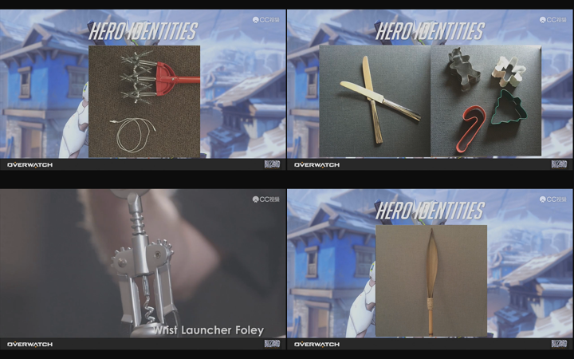
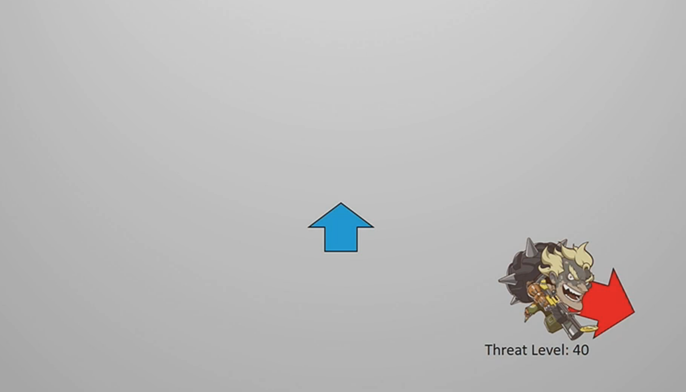
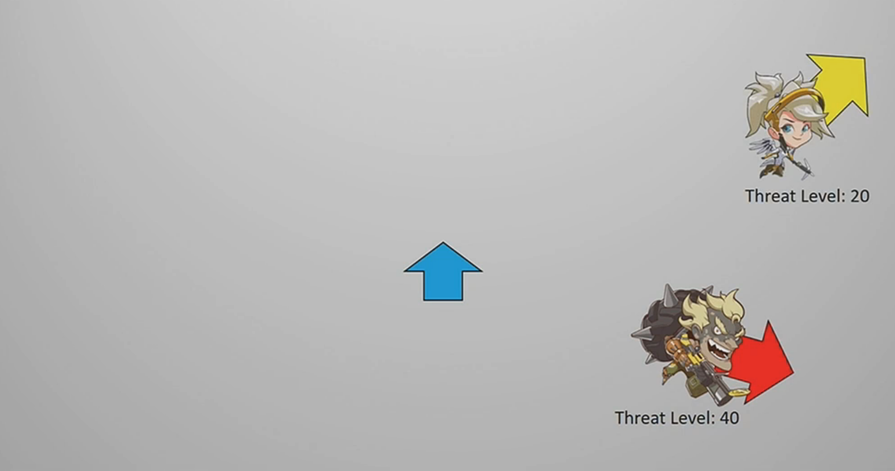
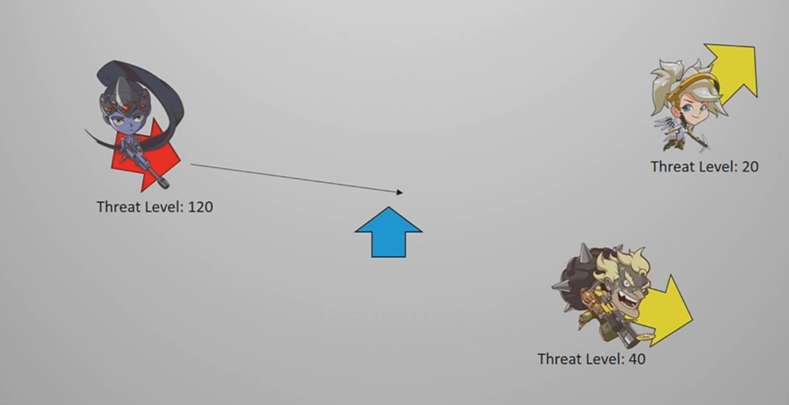
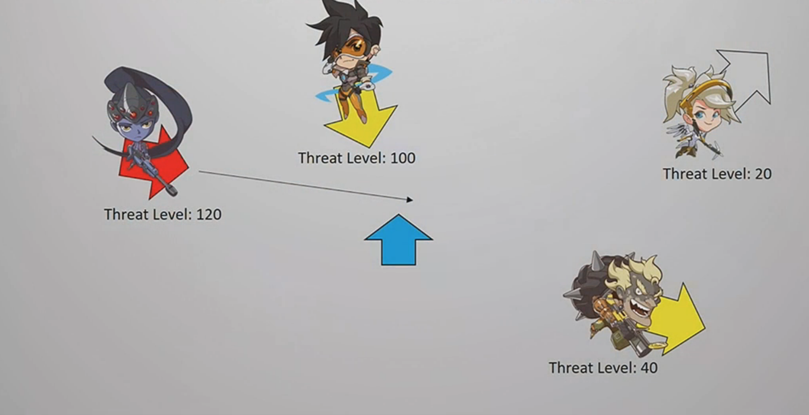

# 关于守望先锋音效的设计理念
## 背景
在 Scott Lawlor 开始着手设计声音系统时，《守望先锋》的游戏总监 Jeffrey Kaplan 给他们一个目标：我可以关掉显示器仅凭声音就可以玩这个游戏。

下面来说下 Scott 的团队是通过哪些工作做到 Play By Sound 的。

## 音源
截止到目前为止守望屁股一共有 23 名英雄，他们的语音和移动中的声音各不相同，在确定声音特点时，设计师们会为每一名英雄确定自己的性格，基于性格特点来确定声音应该是什么感觉的。

那源氏的感觉应该是什么样呢？
#### 锋利、快、灵巧

基于这个大前提，源氏的声音采样来自下面这些东西（蛋糕模具、开瓶器和 iPhone 充电线…）：

因为每一个角色的性格都不同，所以每个角色的声音都不同，甚至细到了身体每个部位的声音，比如路霸的靴子、夹克发出的声音。正是这些不同的声音让每一位英雄都有自己的特点，在战场上也可以根据这些知道有谁在靠近你。

## 反应战场状况和提供操作建议
在紧张的战斗中我们是很难分出精力打字或语音的，因此战斗过程中的音效很大程度上需要及时的为玩家反应战场状况，我们在战斗过程中会听到各种各样的声音，不仅仅是放大的时候，比如「屏障要摧毁了」「我准备好复活你们了」「正在夺取目标点」「前方有狙击手」这类可以帮助你判断应该如何进行下一步操作的音效也至关重要，针对不同的目标和状态让英雄说出不同的台词，这是由一套叫做 Informative Hero VO 的系统做到的。

### Informative Hero VO 

各位如果曾经打过 CS 就会知道，在战斗过程中非常重要的一件事就是听脚步声，根据脚步声判断敌人的距离，从而获得战斗优势的。守望先锋的声音系统则比 CS 复杂的多，比如当战场上存在 DJ 这个英雄并且在加速时，DJ 友军的脚步声就会比平常大的多。如果敌人混在你的队友身边一起行动时，敌人的脚步声也会远大于队友的脚步声。

### Sound Importance Factors
《守望先锋》的音效系统尝试了 HDR（High Dynamic Range）混音，各种各样的声音混杂在一起，玩家则很有可能错过重要的信息，那声音的优先级则势必需要被体现。在传统的 FPS 游戏中，关于音效的大小高低基本上取决于物理距离和物理障碍物，我们会根据声音的大小来判断所受的威胁程度。而在《守望先锋》中，这个规则被打破了，他们不再根据物理距离判断声音大小，而是根据你所受威胁的程度，这项功能来自一个叫「Sound Importance Factors」的系统，这套系统的标准如下：

#### 我在看谁
#### 谁在看我
#### 谁在接近我
#### 谁的枪近
#### 谁在用非常危险的技能
#### 谁对我威胁大

在具体的战斗表现中如下：蓝色箭头是你，你的 4 点钟方向有个狂鼠，他没看到你，此时他对你的威胁程度是 40。

这个时候来个个天使，在你的 2 点钟方向，也没有看到你，她对你的威胁程度是 20，没有狂鼠对你的威胁大（学医救不了中国人的时候战斗天使也很吓人的好吧！）。

这个时候寡妇在你的 9 点钟方向出现了，很不幸她还打开了瞄准镜瞄准了你，此时她对你的威胁程度达到了 120（此种状态的最高等级），同时需要注意的是狂鼠对你的威胁等级下降了。

还没完，正当你战战兢兢不知道该做什么的时候，11 点钟方向又来了个裂空，她也看到你了，此时她对你的威胁等级是 100。需要注意的是，天使的威胁等级下降至可以忽略不计的状态。

到了这个时候我们可以看到目前对你威胁等级最高的英雄是寡妇，所以此时如果她要开枪，你中弹和死亡的几率是最高的，所以她的枪声也是最大的。

上面提到的颜色一共有 4 个等级，具体实现则是在 Wwise 引擎中提供了 High、Normal、Low 和 Cull 4 个有效程度。这个系统还可以帮助识别敌我，针对不同的英雄不同状态分别处理他的声音大小和状态，比如敌方的麦克雷午时已到时，声音更加明亮。

## 相关链接
暴雪嘉年华《Play By Sound》座谈会

[音频引擎为什么会推荐使用Wwise](http://gad.qq.com/article/detail/23725)